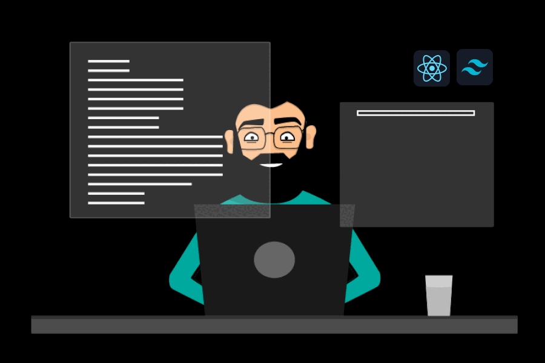

# Hello 👋, I am Fazlul Karim Hridoy

### - 🌱 I’m currently learning - **Next.js**

### - 👯 I’m looking to collaborate on - **MERN Stack projects**

### - 💬 Ask me about - **React.js, MongoDB, Node.js, Express.js**

### - 📫 How to reach me: - fkhridoy4321@gmail.com

 

# :chart_with_upwards_trend: Current Stats

 

  
  

# :computer: Technologies that I know

 

 

  
  

# :books: Recent projects

### :newspaper: Daily pulse newspaper website

- **Description** : A dynamic newspaper portal where publications can publish their news and users can get all them in one platform. And admin dashboard can manage users and publications.

- **Admin credentials**,  
  Email : fkhridoy4321@gmail.com  
  Password : Hridoy98karim@

- **Technologies used** :

  - **Frontend** : React.js, Tailwind CSS, DaisyUI, MambaUI, Hyper UI, react-countup.

  - **Backend** : Node.js, Express.js.

  - **Database** : MongoDB

  - **Authentication** : Firebase authentication with jwt set at cookies.

- **[Client side](https://github.com/fazlulkarimhridoy/daily-pulse-newspaper-client) - [Server side](https://github.com/fazlulkarimhridoy/newspaper-project-server) - [live demo](https://newspaper-client.vercel.app/)**

### :world_map: Local tour guide website

- **Description** : A dynamic tour guide website where people can book a local guide for their visiting purpose and people can create local guide post. A user can update or delete his post and anyone can book guide from the website. In all services page user can find a post by searching with name

- **Technologies used** :

  - **Frontend** : React.js, Tailwind CSS, DaisyUI, MambaUI, Hyper UI, react-simple-typewriter.

  - **Backend** : Node.js, Express.js.

  - **Database** : MongoDB

  - **Authentication** : Firebase authentication with jwt set at cookies.

- **[Client side](https://github.com/fazlulkarimhridoy/local-tour-guide-client) - [Server side](https://github.com/fazlulkarimhridoy/local-tour-project-server) - [live demo](https://local-tour-client.vercel.app)**

### :tshirt: Menverse brand shop website

- **Description** : A dynamic brand shop website where we can add products, update products. And also we can add products to cart and delete them form cards. We can filter products by brand.

- **Technologies used** :

  - **Frontend** : React.js, Tailwind CSS, DaisyUI, MambaUI, Hyper UI.

  - **Backend** : Node.js, Express.js.

  - **Database** : MongoDB

  - **Authentication** : Firebase authentication.

- **[Client side](https://github.com/fazlulkarimhridoy/menverse-brand-shop-client) - [Server side](https://github.com/fazlulkarimhridoy/menverse-brandshop-project-server) - [live demo](https://brand-shop-assignment.vercel.app)**

# :fire: Summary of profile

  

<!-- 

  
  

 -->

<!-- 

  
  

 -->
